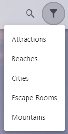
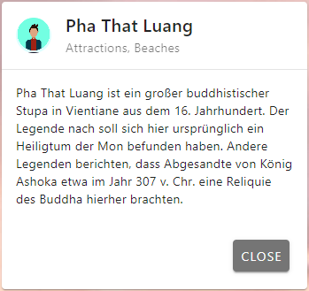
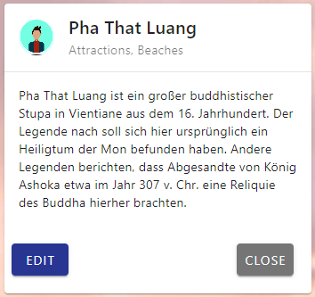
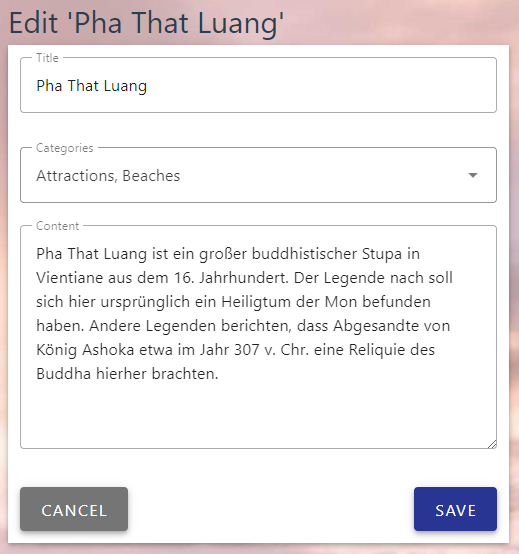
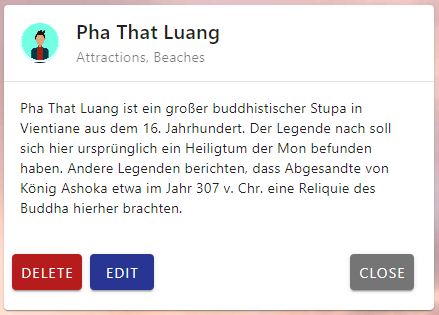
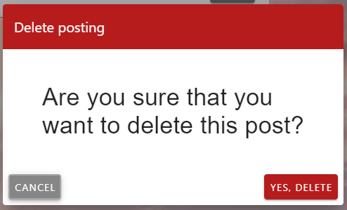

# Vue.js course

This project is meant to teach Vue.js fundamentals by creating a blog, step by step. It uses the [Material Design / Vuetify](https://vuetifyjs.com/en/) framework and stores its data in the Google [Firebase](https://firebase.google.com/) cloud.

Follow these steps to continuously build a client-side Blog web app with [Vue.js](https://vuejs.org/guide/introduction.html).

## 1. Create project
1. In your IDE, create a new Vue.js project:<br/>


2. Create these folders and files:<br/>


3. Create the application routes in [`src/router/index.js`](src/router/index.js):
```javascript
const routes = [
  {path: '/', component: Overview},
  {path: '/posts', component: Overview},
  {path: '/posts/:id', component: Read},
  {path: '/posts/create', component: Create},
  {path: '/posts/update', component: Overview},
  {path: '/posts/save', component: Overview},
  {path: '/posts/delete', component: Overview},
  {path: '/categories', component: Categories},
  {path: '/users', component: Users},
]
```

4. Create and mount all necessary plugins and Vue in `main.js`:<br/>


## 2. Add props to `PostCard`
1. To add `props` to the [`PostCard`](src/components/PostCard.vue) component, insert the following code:
```javascript
const props = defineProps(['title', 'subtitle', 'avatar'])
```
2. In [`Overview`](src/views/posts/Overview.vue), create some test PostCards and pass the proper `props`.
```javascript
const avatars = ref([
'/female_avatar.jpeg',
'/male_avatar.png',
'/user1-128x128.jpg',
])
```
```vue
<v-col v-for="i in 9" :key="i" cols="auto">
  <PostCard :title="'Post no ' + i"
    :subtitle="'Freddie on ' + new Date().toDateString()"
    :avatar="avatars[i % 3]">
      Lorum ipsum...
  </PostCard>
</v-col>
```

## 3. 'Create post' view


1. In [`Create`](src/views/posts/Edit.vue), add these form fields:
```vue
<v-text-field label="Title"  v-model="title" :rules="titleRules" required/>
<v-select label="Categories" v-model="categories" multiple
  :items="['Attractions', 'Beaches', 'Cities', 'Escape Rooms', 'Mountains', 'Museums']">
</v-select>
<v-textarea label="Content" v-model="body" :rules="bodyRules"></v-textarea>
```
2. Add some model states and validation rules:
```javascript
const title = ref('')
const titleRules = [(value) => value ? true : 'Please enter a post title']
const categories = ref([])
const body = ref('')
const bodyRules = [(value) => value ? true : 'Please enter some post content']
```

## 4. Load test postings from [`FireBase`](https://firebase.google.com/docs/web/setup)
1. Follow [these steps](https://firebase.google.com/docs/web/setup) to connect your web app with `FireBase`.
2. Create [`db.js`](src/db.js) a file, where you initialize your FireBase connecttion.
```javascript
...
const app = initializeApp(firebaseConfig)
const db = getFirestore(app)
export default db
```
3. Create a new `FireStore` database, a collection named 'posts' and some test documents.<br/>


4. In `Overview`, load the `FireStore` data in the `onMounted` hook and store the postings in the `posts` state:
```javascript
const posts = ref([])

onMounted(async () => await loadPostings())

async function loadPostings() {
  const postings = await getDocs(collection(db, "posts"))
  ...
  posts.value.push(currentPost)
}
```

## 5. Load categories from `FireStore`


1. In [`main.js`](src/main.js), load the categories from `FireStore`:
```javascript
async function loadCategories() {
  const catCollection = await getDocs(collection(db, "categories"))
  ...
}
```
2. [Provide](https://vuejs.org/guide/components/provide-inject) them to all Vue components:
```javascript
app.provide('categories', await loadCategories())
```
3. In [`App`](src/App.vue), inject and use them as list items:
```vue
const categories = inject('categories')
...
<v-list-item v-for="category in categories">
  {{ category }}
</v-list-item>

```
4. In [`Overview`](src/views/posts/Overview.vue), pass the whole `post` object instead of `title` and `body`:
```vue
<PostCard :post="post" />
```
5. In [`PostCard`](src/components/PostCard.vue), replace `title` and `body` with `props.post`.
```vue
<v-card :title="props.post.title" :subtitle="subtitle">
```
6. Inject the global `categories` and create a [computed property](https://vuejs.org/guide/essentials/computed.html) to 
display the post's categories:
```javascript
const categories = inject('categories')
const subtitle = computed(() => {
  const cats = props.post.categories?.map(cat => categories[cat])
  return cats?.join(', ')
})
```

## 6. 'Show details' feature


1. In the [routes](src/router/index.js), enable [dynamic route parameters](https://router.vuejs.org/guide/essentials/passing-props):
```javascript
{path: '/posts/:id', component: Read, props: true}
```
2. In [`PostCard`](src/components/PostCard.vue), add a dynamic link with the `post.id`.
```vue
<v-card ... link :to="'/posts/' + props.post.id">
```
3. In [`Read`](src/views/posts/Read.vue), implement the posting 'detail view':
```javascript
<script setup>
const props = defineProps(['id'])
const post = ref({})

onMounted(async () => await loadPost(props.id))

async function loadPost(id) {
  const postDoc = await getDoc(doc(db, "posts", id))
  ...
  post.value = {...postDoc.data()}
}
</script>
```
```vue
<template>
  ...
  <v-card :title="post.title" :subtitle="subtitle">
    ...
    <v-card-text>
      {{ post.body }}
    </v-card-text>
  </v-card>
</template>
```

## 7. 'Edit post' feature


1. In the [routes](src/router/index.js), enable [dynamic route parameters](https://router.vuejs.org/guide/essentials/passing-props):
```javascript
{path: '/posts/edit/:id', component: Edit, props: true}
```
2. In [`Read`](src/views/posts/Read.vue), add a button with a link containing the `post.id`.
```vue
<v-btn color="primary" variant="elevated" link :to="'/posts/edit/' + props.id">
  Edit
</v-btn>
```
3. Rename `Create.vue` to [`Edit.vue`](src/views/posts/Edit.vue).
4. For an existing post, load it's data using the ID:
```javascript
onMounted(async () => {
  // only execute for existing posting
  if (props.id) await loadPost(props.id)
})

async function loadPost(id) {
  const post = await getDoc(doc(db, "posts", id))
  if (post.exists()) {
    isNewDoc.value = false
    title.value = post.data().title
    body.value = post.data().body
    categories.value = post.data().categories?.map(cat => cat.id)
  }
}
```
5. The form should now look like this:<br/>

<p></p>

6. Write a `savePost()` function that stores the form data in FireStore:
```javascript
async function savePost() {
    // if there is a validation error, abort
    if (!isValid.value) return false

    // load the FireStore references for selected categories
    const selectedCategories = categories.value?.map(catRef => doc(db, 'categories', catRef))
    const newPost = {
        title: title.value,
        body: body.value,
        categories: selectedCategories
    }
    const coll = collection(db, "posts")
    
    if (isNewDoc.value) {
        // create a new Posting in FireStore
        await addDoc(coll, newPost)
    } else {
        // update the existing Posting in FireStore
        await setDoc(doc(coll, props.id), newPost)
    }
    
    // forward to overview page
    router.push('/posts')
}
```

## 8. 'Delete post' feature


1. In [`Read`](src/views/posts/Read.vue), add a delete button:
```vue
<v-btn color="red-darken-4" variant="elevated" v-bind="props">
  Delete
</v-btn>
```

2. Create a confirmation dialog:<br/>

```vue
<v-dialog width="auto">
  <template v-slot:default="{ isActive }">
    <v-card>
      <v-toolbar color="red-darken-4" title="Delete posting"/>
      <v-card-text>
        <div class="text-h4 pa-8">
          Are you sure that you<br/>
          want to delete this post?
        </div>
      </v-card-text>
      <v-card-actions class="justify-space-between">
        <v-btn variant="elevated" color="grey-darken-1"
           @click="isActive.value = false">
          Cancel
        </v-btn>
        <v-btn variant="elevated" color="red-darken-4"
           @click="deletePost(props.id)">
          Yes, delete
        </v-btn>
      </v-card-actions>
    </v-card>
  </template>
</v-dialog>
```

3. Write a `deletePost()` function that deletes the posting in FireStore:
```javascript
async function deletePost(id) {
    await deleteDoc(doc(db, "posts", id))
    // forward to overview page
    router.push('/posts')
}
```


### Project Setup
```sh
npm install
```

### Compile and Hot-Reload for Development

```sh
npm run dev
```

### Compile and Minify for Production

```sh
npm run build
```
